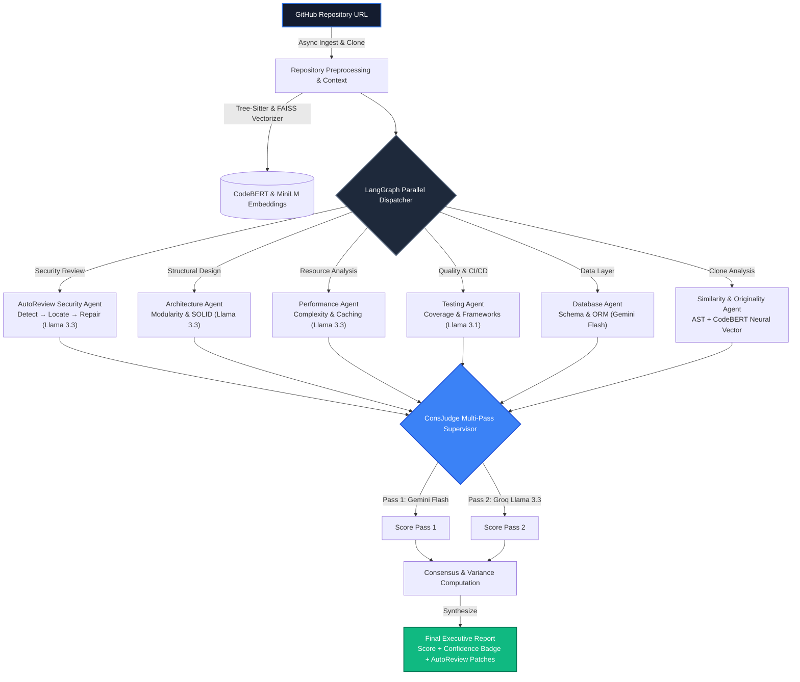

<div align="center">
  <h1>⚡ CodeBeast AI ⚡</h1>
  <p><strong>Research-Backed Multi-Agent Repository Intelligence & Automated Scoring Platform</strong></p>
  <p><em>Engineered for Technical Hiring, Hackathon Evaluations, and Automated Code Audits</em></p>

  <p>
    <a href="#why-codebeast-ai">Why CodeBeast?</a> •
    <a href="#research-backed-advancements">Research Foundations</a> •
    <a href="#system-architecture">Architecture</a> •
    <a href="#multi-agent-pipeline">Agents</a> •
    <a href="#quickstart">Quickstart</a> •
    <a href="#features--ui">Features</a>
  </p>

  <p>
    
    
    
    
    
    
  </p>
</div>

---

## 🔬 Research-Backed Advancements

CodeBeast AI incorporates three major peer-reviewed and preprint advancements in AI code evaluation:

| # | Research Foundation | Problem Solved | Implementation in CodeBeast AI |
|---|---|---|---|
| **1** | **ConsJudge: Multi-Pass Consensus** (*LLM-as-a-Judge Consistency*) | Unverified, potentially hallucinated single-pass scores | Runs dual concurrent supervisor passes (Gemini + Groq Llama 3.3). Computes variance margin ($\pm \text{points}$) and issues a **ConsJudge Verified Confidence Badge** (High / Moderate / Low). |
| **2** | **ASTNN & CodeBERT Neural Embeddings** (*Semantic Clone Detection*) | Fragile commit heuristics that fail on copy-paste code | Extracts Tree-Sitter normalized AST syntax trees and computes CodeBERT semantic embeddings with FAISS vector similarity to calculate a true **Originality Score (0-100)** and detect template clones. |
| **3** | **AutoReview: 3-Stage Pipeline** (*ACM FSE 2025: Detect → Locate → Repair*) | Shallow, single-pass security reviews with no actionable fixes | **Detect**: Classifies CWE taxonomy (CWE-89, CWE-798, CWE-78).<br>**Locate**: Pinpoints exact file coordinates and exploit vectors.<br>**Repair**: Generates unified diffs and defensive test guidance. |

---

## 🏗️ System Architecture



---

## ⚡ Quickstart

### Option A: One-Click Runner (Windows PowerShell / Batch)

Launch all services (Redis, FastAPI backend, Celery multi-agent worker, and Next.js frontend) with a single command:

```powershell
# PowerShell
.\run_all.ps1

# Or Windows Command Prompt / Batch
run_all.bat
```

Services will be accessible at:
* **Frontend Dashboard:** [http://localhost:3000](http://localhost:3000)
* **Live Agent Monitor:** [http://localhost:3000/live](http://localhost:3000/live)
* **Backend OpenAPI Docs:** [http://localhost:8000/docs](http://localhost:8000/docs)

---

### Option B: Manual Setup

#### 1. Backend & Celery Worker
```bash
cd backend
python -m venv venv
venv\Scripts\activate
pip install -r requirements.txt

# Start FastAPI server
uvicorn main:app --reload --reload-dir app --reload-exclude worker_repos

# Start Celery Worker in a separate terminal
celery -A app.worker.celery_app worker --loglevel=info -P threads
```

#### 2. Frontend
```bash
cd frontend
npm install
npm run dev
```

---

## 🧪 Automated Verification Suite

Run our comprehensive test suite verifying the research-backed features:

```powershell
cd backend
venv\Scripts\activate

# 1. Test ConsJudge Multi-Pass Inter-Judge Consistency
python test_judge_consistency.py

# 2. Test 6-Agent LangGraph Pipeline with AST/CodeBERT Similarity
python test_similarity_pipeline.py

# 3. Test AutoReview 3-Stage Security Pipeline (Detect -> Locate -> Repair)
python test_autoreview_security.py
```

---

## 📊 Live Evaluation UI

* **Real-time Agent Monitoring**: Watch the 6 specialized AI nodes execute in parallel over WebSockets.
* **ConsJudge Confidence Badges**: Dynamic confidence indicators (`High Confidence ±2.5 pts`, `Moderate Confidence`, `Low Confidence`) with inter-judge variance metrics.
* **AutoReview Security Patches**: Actionable unified git diffs and CWE matrices.
* **AST & CodeBERT Originality Breakdown**: Neural clone detection graphs and template similarity ratios.

---

## 🛡️ License & Acknowledgments

Built for technical evaluations, hackathon judging, and automated software reviews. Grounded in peer-reviewed AI software engineering research (FSE 2025 AutoReview, ConsJudge 2025, ASTNN).
